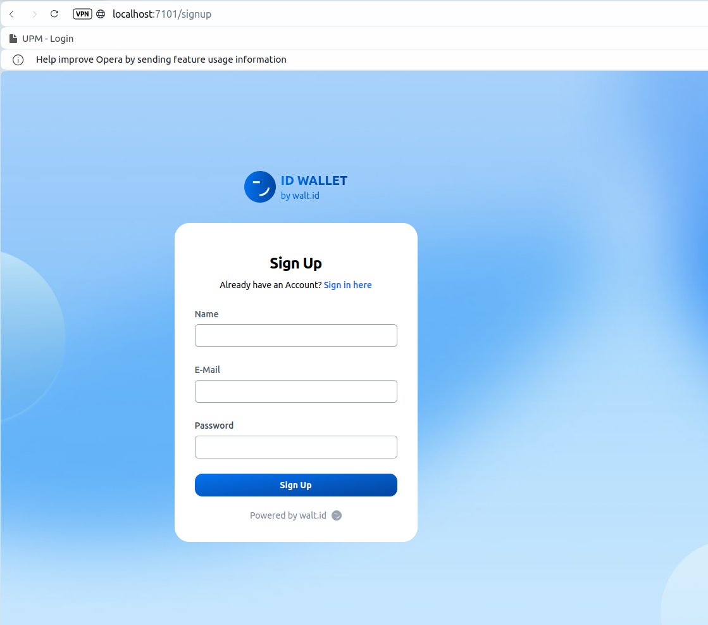
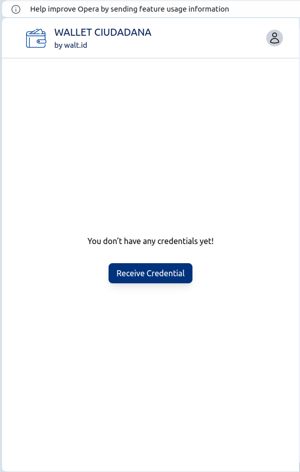
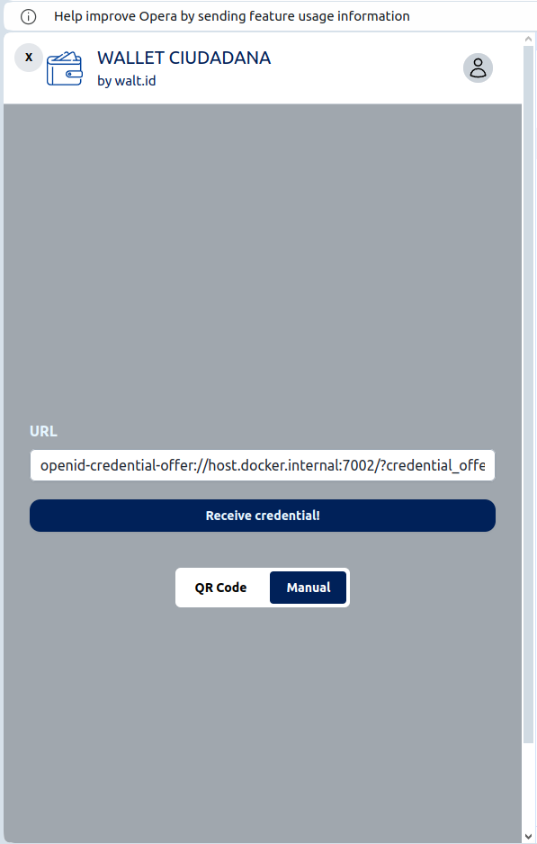
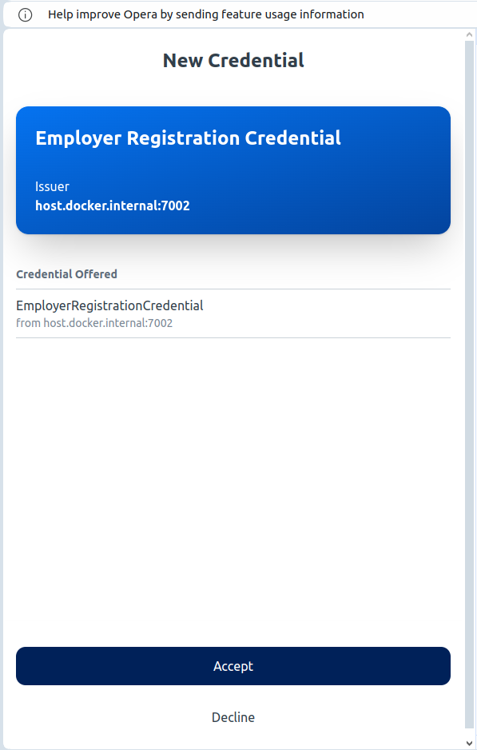
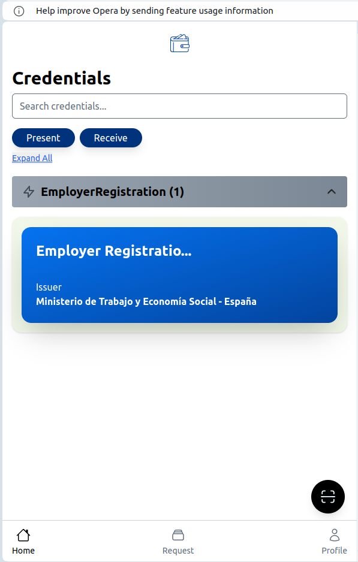

Watch the 3‑minute demo on YouTube ▶ https://www.youtube.com/watch?v=GjZqYCDlQhc

# SeguridadSocialWeb Project

This repository contains a full‑stack web application with multiple components (front‑end, back‑end, credential issuer coordination, Vault initialization, and WALT.ID identity services). The goal is to demonstrate credential issuance (like DNI, passport, work registration) using decentralized identities (DIDs) and a secure Vault.

---

## Project Structure

```
- frontend
- backend
- issuer_coord
- vault-init
- waltid-identity
- docker-compose.yml   (root-level Docker Compose for some services)
```

### 1. `frontend`
A web-based user interface for interacting with the SeguridadSocialWeb application.

### 2. `backend`
Contains server-side logic for business features.

### 3. `issuer_coord`
Coordinates the issuance of different credentials (e.g., DNI, passport, work registration). It exposes endpoints to retrieve issuer DIDs and generate credential offer URLs.

### 4. `vault-init`
Automates the initialization of HashiCorp Vault, which is used for secure storage of secrets, policies, and AppRoles.

### 5. `waltid-identity`
This directory includes WALT.ID identity Docker Compose files, running an identity wallet service that can issue, manage, and verify credentials.

---

## Requirements

- **Docker Desktop** (or equivalent Docker environment).
- Basic knowledge of running Docker Compose commands.

---

## Setup and Launch Instructions

1. **Initialize Vault** via `vault-init`.

   - Inside the `vault-init` directory, refer to the instructions (e.g. `README.md` there or `setup_all.sh`).
   - Run the script to create the Docker network and volume for Vault, spin up the Vault container, build the `vault-init` Docker image, and execute the unseal and policy setup steps.

2. **Launch the main application** (frontend + backend) from the root directory:
   ```bash
   docker-compose up -d
   ```
   This will start the front-end (`frontend`) and back-end (`backend`) services (and any other containers defined in the main `docker-compose.yml`).

3. **Launch WALT.ID Identity** container(s):
   ```bash
   cd waltid-identity
   docker-compose up -d
   ```
   This will spin up the WALT.ID identity wallet services on (by default) port `7101` or as configured in that folder’s `docker-compose.yml`.

At this point:
- **Vault** is running and unsealed.
- **Frontend** and **Backend** are running (check your Docker Desktop or `docker ps`).
- **WALT.ID Identity** services are running.

---

## Issuing Credentials (Demo Setup)

To fully demonstrate the system, you will issue **3 credentials**:
1. **DNI**
2. **Passport**
3. **Work Registration**

These credentials are issued by the `issuer_coord` module via specific HTTP endpoints.

1. **Obtain Issuer DIDs**
   Open a terminal (or use an API tool like Postman) and issue:
   ```bash
   curl -X GET http://localhost:5500/did
   ```
   You’ll receive a response similar to:
   ```json
   {
       "issuer1Did": "did:key:z6Mki7UWb1dkspvrRgZQbHoJbUn3YjBejQ8Gwff42A5SqUzc",
       "issuer2Did": "did:key:z6MkwXXk7rJk23PCH1igRvudLbfcZaohfU1yBaisURwggfv9",
       "issuer3Did": "did:key:z6MkevXr12RRfcWaaePTcshCbXoJ1o8VyjxBVaz56JqW3sLy"
   }
   ```
   This confirms the DIDs for each issuer.

2. **Issue 3 Credentials**
   For each credential type, make a **POST** request to:
   ```bash
   curl -X POST http://localhost:5500/credentials/issue         -H "Content-Type: application/json"         -d '{"type": "<type>"}'
   ```
   Where `<type>` can be:
   - `identity` (DNI)
   - `passport`
   - `work` (work registration)

   Each call returns a JSON with an `issuanceUrl`, for example:
   ```json
   {
       "issuanceUrl": "openid-credential-offer://host.docker.internal:7002/?credential_offer_uri=http%3A%2F%2Fhost.docker.internal%3A7002%2Fopenid4vc%2FcredentialOffer%3Fid%3D70ed22b0-2b61-429a-b877-48fb7023067b"
   }
   ```
   - This `issuanceUrl` is the “offer URL” for retrieving the credential of the specified type.

   **Repeat** for each credential type (`identity`, `passport`, `work`).

---

## 3. Access the Wallet

Once you have the issuance URLs (the `offerUrl`) obtained in the previous step, follow these steps:

1. Open your browser and go to [http://localhost:7101](http://localhost:7101).
2. Create an account (if you haven't already) and then log in to the wallet.

**Reference screenshots for the Wallet:**

Sign up:



Click on "Receive Credential"



Select "Manual" and paste the offerURL obtained in previous steps



Accept the credential



Credential has been added



You will **present the 3 URLs** (the `issuanceUrl` or `offerUrl`) you received when making the `POST` requests to `http://localhost:5500/credentials/issue`. This will allow you to obtain the three credentials (`work`, `identity`, and `passport`) in your wallet.

---

## 4. Use the Web Application
- Navigate to [https://localhost/](https://localhost/) or the appropriate front-end URL.
- Log in or interact with the front-end features.
- The system will now be aware of your credentials as stored in the wallet.
- We have prepared a demo video showing the user flows: https://www.youtube.com/watch?v=GjZqYCDlQhc

---

## Summary

By completing the above steps, you have:

1. **Initialized** and **unsealed** Vault for secrets management.
2. **Launched** the main SeguridadSocialWeb (frontend and backend) plus the WALT.ID identity services.
3. **Issued** 3 sample credentials using `issuer_coord`.
4. **Collected** them into your WALT.ID wallet.
5. **Accessed** the front-end to see how credentials can be used.

---

**Enjoy testing and exploring the SeguridadSocialWeb project!**

If you have any questions or issues, please refer to logs (`docker logs <container-name>`) or open an issue in this repository.

---

## License

Licensed under the MIT License.
See [LICENSE](LICENSE) for details.